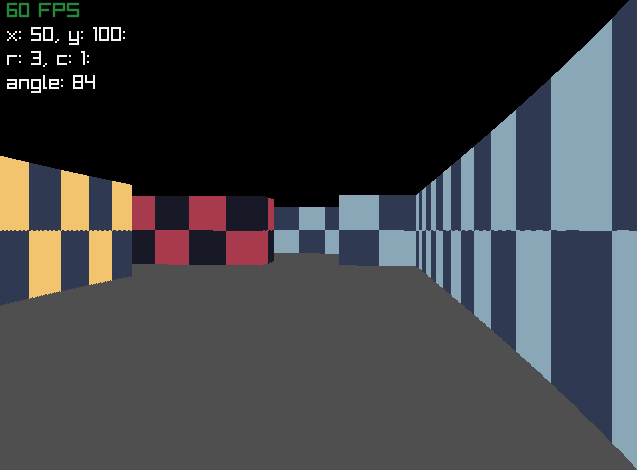

# A simple Raycasting engine

It is a simple raycasting engine, programmed with the C language
and the Raylib library.

With this engine I will try to make a simple rpg.

# forked from: 
https://github.com/urashima0912/raycasting

4/5/23
attempting to build using: 
https://bedroomcoders.co.uk/creating-a-64-bit-executable-with-raylib-on-windows/
(debian from windows store)
home: \\wsl$\Debian\home\norrisa
files are in ~/dev/raylib
i had to sudo the make since wsl ownership/permissions for the copied raylib/src directory is off

Notes on algo types:
shredded nerd doom binary space partitioning video
12:50 is intro to discussion of painters algorithm vs. raycasting (covered earlier for wolf3d) vs BSP
also mentions warnock's algorithm (which is front to back) -- subdivides below pixel size
z-buffer (per pixel)
the actual solution is z-buffer with binary space partitioning tree
draw closest to furthest, with no overdraw

